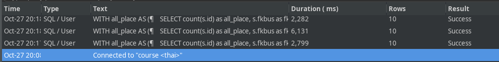
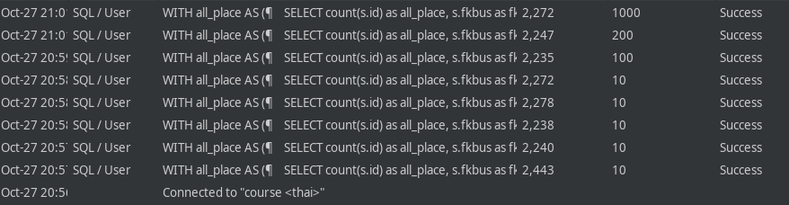

### Развернуть ВМ (Linux) с PostgreSQL

Развёрнуто
 
### Залить Тайские перевозки
   
Залито

### Проверить скорость выполнения сложного запроса (приложен в конце файла скриптов)

Запускаем запрос на исполнение несколько раз

```postgresql
WITH all_place AS (
    SELECT count(s.id) as all_place, s.fkbus as fkbus
    FROM book.seat s
    group by s.fkbus
),
order_place AS (
    SELECT count(t.id) as order_place, t.fkride
    FROM book.tickets t
    group by t.fkride
)
SELECT r.id, r.startdate as depart_date, bs.city || ', ' || bs.name as busstation,  
      t.order_place, st.all_place
FROM book.ride r
JOIN book.schedule as s
      on r.fkschedule = s.id
JOIN book.busroute br
      on s.fkroute = br.id
JOIN book.busstation bs
      on br.fkbusstationfrom = bs.id
JOIN order_place t
      on t.fkride = r.id
JOIN all_place st
      on r.fkbus = st.fkbus
GROUP BY r.id, r.startdate, bs.city || ', ' || bs.name, t.order_place,st.all_place
ORDER BY r.startdate
limit 10;
```



Запрос исполнялся от 2 до 6 секунд.

### Навесить индексы на внешние ключ

```postgresql
CREATE INDEX fkschedule_ride_idx ON book.ride (fkschedule) WITH (deduplicate_items = off);
CREATE INDEX fkroute_busroute_idx ON book.schedule (fkroute) WITH (deduplicate_items = off);
CREATE INDEX fkbusstationfrom_busstation_idx ON book.busroute (fkbusstationfrom) WITH (deduplicate_items = off);
CREATE INDEX fkride_tickets_idx ON book.tickets (fkride) WITH (deduplicate_items = off);
CREATE INDEX fkbus_seat_idx ON book.seat (fkbus) WITH (deduplicate_items = off);

```

### Проверить, помогли ли индексы на внешние ключи ускориться

Запускаем запрос на исполнение несколько раз

